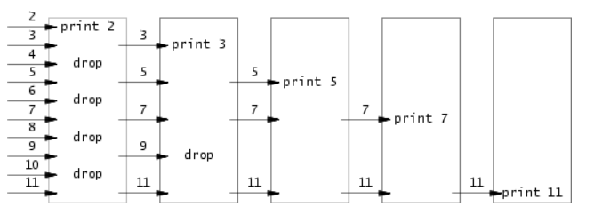

## Lab1 : Utils

### Boot xv6

根据官方文档完成环境配置，随后启动。


---

### sleep

如果用户忘记传入参数了, 报错并退出. 不然就parse输入的参数为int, 直接调用系统函数sleep。

```c
#include "kernel/types.h"
#include "user/user.h"

int main(int argc,char *argv[]){
    if(argc != 2){
        fprintf(2, "Usage: sleep <time>\n");
        exit(1);
    }

    int sleeptime=atoi(argv[1]);
    sleep(sleeptime);

    exit(0);
}
```

---

### pingpong

利用系统调用函数fork和pipe在父进程和子进程前交换一个字节。
系统调用:

1. 可以使用pipe(一个二位的数组)来初始化一个管道.经过pipe了之后,第一个元素就是一个读取的端口,第二个元素就是对应写入的端口,
2. 可以使用read(读端口,读出来的元素写在哪里,长度)来从一个读的端口读出元素
3. 可以使用write(写端口,写出来的元素写在哪里,长度)来把元素写进一个端口.

fork函数就是一次调用,两次返回,调用之后父进程和子进程都从获得函数的返回值开始继续往下运行。

```c
#include "kernel/types.h"
#include "user/user.h"

int main(int argc,char *argv[]){
    int pid;
    int p[2];
    pipe(p);

    if(fork()==0){    //children receive and send
        pid=getpid();
        char buf[2];
        if(read(p[0],buf,1)<=0){
            fprintf(2, "children read error...\n");
            exit(1);
        }
        printf("%d: received ping\n",pid);
        close(p[0]);
        if (write(p[1],buf,1)<=0){
            fprintf(2, "children write error...\n");
            exit(1);
        }
        close(p[1]);
    }else{            //parent send and receive
        pid=getpid();
        char info[2]="a";
        char buf[2];
        buf[1]=0;
        if(write(p[1],info,1)<=0){
            fprintf(2, "parent write error...\n");
            exit(1);
        }
        close(p[1]);
        wait((int*) 0);
        if(read(p[0],buf,1)<=0){
            fprintf(2, "parent read error...\n");
            exit(1);
        }
        printf("%d: received pong\n",pid);
        close(p[0]);
    }
    exit(0);
}
```

---

### Primes



```
p = get a number from left neighbor
print p
loop:
    n = get a number from left neighbor
    if (p does not divide n)
        send n to right neighbor
```

主进程的数据首先从左到右到第一个子进程,判断能不能被2除,不可以就继续从左到右交给下一个子进程,判断能不能被3除…,如果下一个子进程是不存在的,那么新建一个进程,这个进程就代表对应数。

```c
#include "kernel/types.h"
#include "user/user.h"

void newprocess(int p[2]){
    close(p[1]);
    int prime;
    if (read(p[0],&prime,sizeof(prime))){
        fprintf(2,"prime %d\n",prime);
        int p2[2];
        pipe(p2);
        if (fork()==0){
            close(p2[1]);
            newprocess(p2);
        }else{
            close(p2[0]);
            int i;
            while(read(p[0],&i,sizeof(i))){
                if (i%prime!=0){
                    if (write(p2[1],&i,4)!=4){
                        printf("write to pipe false");
                        exit(1);
                    }
                }
            }
            close(p2[1]);
            wait(0);
        }
    }
    exit(0);
}

int main(int argc,char *argv[]){
    int p[2];
    pipe(p);
    if (fork()==0){
        newprocess(p);
    }else{
        close(p[0]);
        fprintf(2,"prime 2\n");
        for (int  i = 3; i <= 35; i++){
            if (i%2!=0){
                if (write(p[1],&i,4)!=4){
                    printf("write to pipe false");
                    exit(1);
                }
            } 
        }
        close(p[1]);
        wait((int*) 0);
    }
    exit(0);
}
```

---

### find

编写一个简单版本的 UNIX 查找程序：在目录树中查找名称与字符串匹配的所有文件。直接从ls.c修改就行。

```c
#include "../kernel/types.h"
#include "../kernel/stat.h"
#include "../user/user.h"
#include "../kernel/fs.h"

void ls(char *directory,char *filename){
    char buf[512], *p;
    int fd;
    struct dirent de;
    struct stat st;

    if((fd = open(directory, 0)) < 0){
        fprintf(2, "ls: cannot open %s\n", directory);
        return;
    }

    if(fstat(fd, &st) < 0){
        fprintf(2, "ls: cannot stat %s\n", directory);
        close(fd);
        return;
    }

    switch(st.type){
    case T_FILE:
        fprintf(2,"ls: cannot get there\n");
        exit(1);

    case T_DIR:
        if(strlen(directory) + 1 + DIRSIZ + 1 > sizeof buf){
            printf("ls: path too long\n");
            break;
        }
        strcpy(buf, directory);
        p = buf+strlen(buf);
        *p++ = '/';
        while(read(fd, &de, sizeof(de)) == sizeof(de)){
            if(de.inum == 0||strcmp(de.name,".")==0||strcmp(de.name,"..")==0)
                continue;
            memmove(p, de.name, DIRSIZ);
            p[DIRSIZ] = 0;
            
            if(stat(buf, &st) < 0){
                printf("ls: cannot stat %s\n", buf);
                continue;
            }
        
            if (st.type==T_FILE){
                if (strcmp(de.name,filename)==0){
                    printf("%s\n",buf);
                }
                
            }else{
                ls(buf,filename);
            }
        }
        break;
    }
    close(fd);
}

int main(int argc, char *argv[]){
    if(argc !=3){
        fprintf(2, "usage: find [directory] [target filename]\n");
        exit(1);
    }
    ls(argv[1],argv[2]);
    exit(0);
}
```

---

### xargs

将标准输入里每一个以'\n'分割的行作为单独1个额外的参数, 传递并执行下一个命令。先复制命令，随后按照\n分割输入的参数，由子进程执行命令。

```c
#include "../kernel/types.h"
#include "../user/user.h"
#include "../kernel/param.h"

int main(int argc,char *argv[]){
    char *xargv[MAXARG];
    char buf[512];
    for (int i = 1; i < argc; i++){
        xargv[i-1]=argv[i];
    }
    while (1){
        int readid=0;
        int readlen=0;
        while (1){
            readlen=read(0,&buf[readid],sizeof(char));
            if (readlen==0||buf[readid]=='\n'){
                break;
            }
            readid++;
        }
        if (readlen==0){
            break;
        }
        buf[readid]='\0';
        xargv[argc-1]=buf;
        if (fork()==0){
            exec(xargv[0],xargv);
            exit(0);
        }else{
            wait(0);
        }
    }
    exit(0);
}
```
